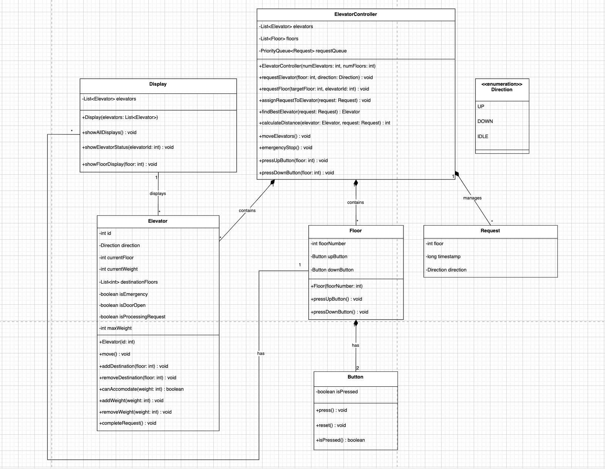
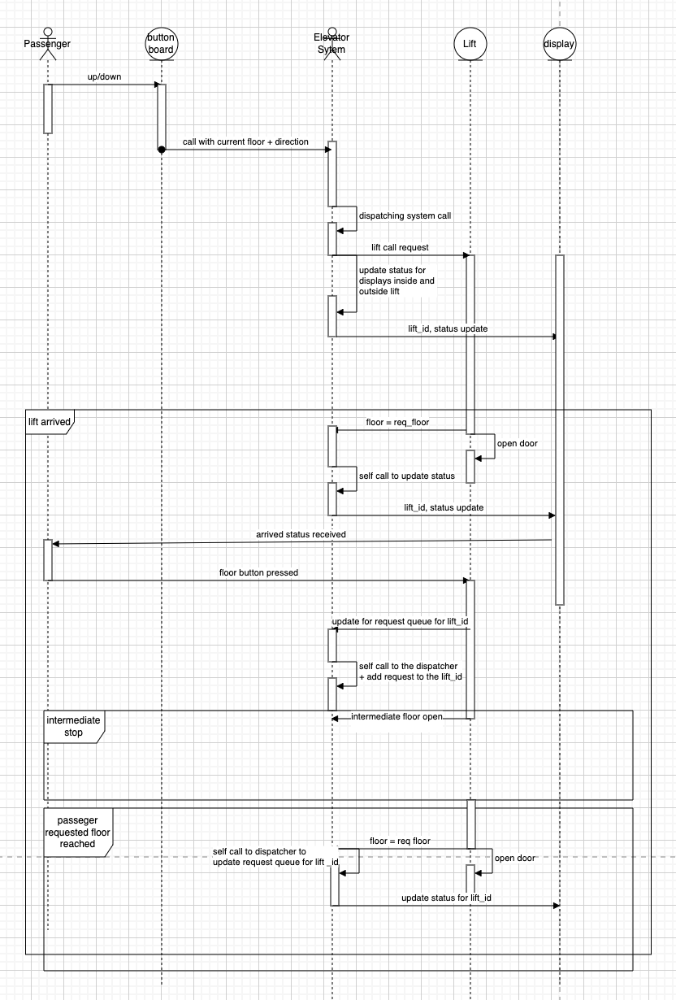

# Elevator System - Low Level Design

A Java-based implementation of an elevator system with multiple elevators, following SCAN algorithm for efficient movement and handling both external and internal requests.

## System Requirements

- Java 21 or higher
- Maven 3.9.9 or higher
- Lombok (included in dependencies)

## Features

- **Multiple Elevators**: System supports 6 elevators
- **Building Floors**: 20 floors (0-19)
- **Capacity Management**: 
  - Maximum 1000 kg weight limit per elevator
  - Average passenger weight: 65 kg
- **Smart Movement**: 
  - SCAN algorithm for efficient elevator movement
  - Direction-based floor selection
  - Automatic door operations
- **Emergency Handling**: Emergency stop functionality
- **Real-time Status**: Display of elevator positions and states

## Class Diagram



## Sequence Diagram



## System Components

### 1. Elevator Class
- Manages individual elevator state
- Handles passenger weight tracking
- Controls door operations automatically
- Tracks emergency state and processes requests

### 2. ElevatorController Class
- Manages multiple elevators
- Handles external and internal requests
- Implements request assignment logic using SCAN algorithm
- Coordinates elevator movements and door operations
- Provides emergency stop functionality

### 3. Main Class
- Provides command-line interface
- Handles user interactions through a menu system
- Displays system status and updates
- Manages the lifecycle of the application

### 4. Floor Class
- Represents a floor in the building
- Handles floor-specific operations and requests
- Manages up and down buttons for elevator requests

### 5. Button Class
- Represents buttons for elevator requests
- Handles user interactions for direction requests
- Tracks button press state

### 6. Display Class
- Manages the display of elevator and floor statuses
- Provides methods to show the status of a specific floor, a specific elevator, or all displays in the system
- Displays information such as elevator direction, door status, emergency status, and current weight

### 7. Request Class
- Represents an elevator request
- Contains attributes for the requested floor, direction (up or down), and a timestamp

## How to Run

1. **Build the Project**:
   ```bash
   mvn clean install
   ```

2. **Run the Application**:
   ```bash
   java -cp target/elevator-system-1.0-SNAPSHOT.jar com.elevator.Main
   ```

## Usage Guide

### Menu Options

1. **Request Elevator**
   - Enter current floor (0-19)
   - Select direction (1 for UP, 2 for DOWN)
   - System assigns the request to the most suitable elevator using the SCAN algorithm

2. **Show Status**
   - Displays the current state of all elevators and floors
   - Shows elevator position, direction, door status, emergency status, and current weight

3. **Request Floor (Inside Elevator)**
   - Select elevator ID (0-5)
   - Enter target floor (0-19)
   - System checks weight capacity before accepting the request

4. **Emergency Stop**
   - Immediately stops all elevators
   - Closes all doors
   - Clears all pending requests
   - Sets all elevators to an emergency state

5. **Exit**
   - Safely terminates the application

### Additional Features

- **Automatic Operations**:
  - Doors open automatically at destination floors
  - Doors close after passengers enter/exit
  - Weight tracking for capacity management
  - SCAN algorithm for efficient movement

- **Display System**:
  - Provides real-time updates on elevator and floor statuses
  - Displays information such as direction, door status, and emergency state

## System Behavior

1. **External Request Handling**:
   - User requests elevator from a floor
   - System assigns request to nearest available elevator
   - Elevator moves to requested floor using SCAN algorithm

2. **Internal Request Handling**:
   - User enters elevator when doors open
   - System adds passenger weight (65 kg)
   - User selects target floor
   - Elevator moves to destination

3. **Automatic Operations**:
   - Doors open automatically at destination floors
   - Doors close after passengers enter/exit
   - Weight tracking for capacity management
   - SCAN algorithm for efficient movement

## Design Patterns and Principles

- **Single Responsibility Principle**: Each class has a specific responsibility
- **Encapsulation**: Internal state management within classes
- **Command Pattern**: User commands through menu interface
- **Observer Pattern**: Status updates through display system

## Project Structure

```
src/main/java/com/elevator/
├── Main.java                 # Application entry point
├── model/
│   ├── Direction.java        # Elevator direction enum
│   ├── Elevator.java         # Elevator implementation
│   └── Request.java          # Request model
├── service/
│   └── ElevatorController.java # Elevator management
└── display/
    └── Display.java          # Status display system
```

## Future Enhancements

1. Support for multiple passengers per elevator
2. Advanced scheduling algorithms
3. Priority requests (e.g., emergency services)
4. Energy efficiency optimizations
5. GUI interface